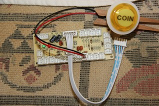

Using 24mm illuminated buttons, I used a DYMO LetraTag with clear labels  
Coin in Large Bold text, Play & Exit in Medium Bold text 
  
Coin(Select), Play(Start), Exit(Hotkey)  
 
   
Wiring of Buttons: SPST switch on bottom, +ve/Gnd of LED on top  
  
Zero Delay USB Encoder CY-822A  
You will need to add an extra socket (Jst Xh 2.5-2 Pin Connector Plug Female/Male type)  
and wire a parallel chain of power leads 24-26AWG with 2.8mm Female Spade connectors to LED +ve/Gnd contacts.  

More current model may have +5V sockets on board

2.8mm Female Spade
Jst Xh 2.5-2 Pin Connector Plug Female/Male

