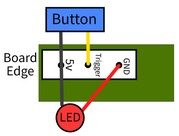
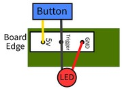
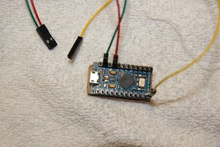

## **Coin and Play Illuminated Buttons**
WIre buttons to be Always-on or Lit-when-pressed.    
Using 24mm illuminated buttons, I used a DYMO LetraTag with clear labels  
Coin in Large Bold text, Play & Exit in Medium Bold text 
  
Coin(Select), Play(Start), Exit(Hotkey)  
Buttons Coin & Play: always-on, while Exit: lit-when-pressed (special wiring)  
 
   
Wiring of Buttons: SPST switch on bottom, +ve/Gnd of LED on top  
  
Zero Delay USB Encoder CY-822A  
You will need to add an extra socket (Jst Xh 2.5-2 Pin Connector Plug Female/Male type)  
and wire a parallel chain of power leads 24-26AWG with 2.8mm Female Spade connectors to LED +ve/Gnd contacts.  
 
Lit-when-pressed blue Exit button has special wiring, using 2 wire Zero Delay USB Encoder CY-822A.  
Since Zero Delay USB Encoder uses common +ve, and Key inputs are pulled-low,  
when button is pressed, input signal will short to +5V (high to the MCU glob-top).  
Reverse the SPST switch contacts red & black (with extra yellow lead) wires and connect the yellow wire to LED +ve contact. The LED Gnd will use the black daisy chain wire. What is happening: LED cathode is connected to Gnd (normal), but Anode is connected to input signal which is pulled-low by the MCU. Both side are Gnd and LED does not light. When you press the button, you short input signal to +5V, which is jumpered to LED anode, the LED glows.  
 
For 3 wire Zero Delay USB Encoder CY-822B with Black-Yellow-Red (always-on) sockets change wiring to Yellow-Black-Red (lit-when-pressed) in socket. (Note: wire polarity of Red & Black are reversed from colour standard where harnesses are Red is Gnd, Black is +5V, Yellow (center pin) is pin signal.)
 Blog [Here](http://cy-822b.blogspot.com/2016/08/the-cy-822b-usb-led-joystick-controller.html)  
   
&nbsp; &nbsp; &nbsp; &nbsp; Always-on &nbsp; &nbsp; &nbsp; &nbsp; &nbsp; &nbsp; &nbsp; &nbsp; &nbsp; &nbsp; &nbsp; &nbsp; &nbsp; &nbsp; &nbsp; &nbsp; &nbsp; &nbsp; &nbsp; Lit-when-pressed   
 
More current USB Encoder model(s) may have +5V sockets (red Jst Xh) on board.  
  
  
Arduino Pro Micro with ATmega32U4 MCU  
If you are using an Arduino MCU the inputs are pulled-high for input then shorted to Gnd (Input Pin current limit of 40mA, use a 390Ω - 470Ω resistor to be safe).
Initially both sides of LED will be +5V and Button (SPST switch) shorts to Gnd pulling input low, which triggers a button-press and LED to light. The LED +ve will use the red daisy chain wire, LED Gnd will jumper to input pin. Arduino MCUs use common Gnd for inputs which is reverse to Zero Delay USB Encoders. Wiring must adjust to new common. Arduino boards also use Dupont connectors on pin headers.
