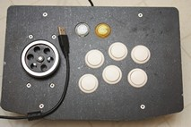

## **Arcade-Spinner** 
Arcade Spinner version 2 - based off earlier 'jmtw000' version   
  
**Using an Arduino Pro Micro - DIY Spinner Controller, plus affordable Rotary Encoder**  
I decided to post my version of code including 'compiler control directive code' for rotary encoder (spinner) movement, and addition of extra buttons that a standard fight box had pre-configured cut holes (6-30mm & 2-24mm). The code works with Arduino Pro Micro style boards made by clone manufacturers. The original code posted by 'jmtw000' has mutated to be used with Arduino Micro, Adafruit Itsy Bitsy, and other style boards that have extra pinouts unused by status LEDs. You will not find pins 11, 12, and 13 (also SS, 3V, Aref, A4, A5 & 2-NCs) on an  Arduino [Pro Micro](Pics/Arduino%20Pro%20Micro%20Atmega32u4.jpg) board (length saving of 0.66") but pins 14, 15, and 16 (MISO/SCLK/MOSI). They appear to be mapped to different ATMega Portx bits.  
A simplified chinese knock-off Rotary Encoder of an industrial Omron E6B2-CWZ6C encoder costing hundreds can be obtained from online stores around $30. Investigate purchase wisely as quality and standardization may vary. Ditto for selection of Arduino Pro Micro boards compatible to Sparkfun board, making sure you get 5V/16MHz version with pre-installed bootloader and pin headers. An USB 2.0 type A-to-MicroB cable of 3 to 6 feet will be needed, and not a two conductor charge cable.  
Here are some brandname Arduino boards:  
* Arduino [Micro](Pics/Arduino%20Micro%20(Adafruit).jpg) by Arduino Srl & Adafruit  
* Arduino [Micro](Pics/Adafruit%20ItsyBitsy%20-%20Arduino%20Micro.jpg), Adafruit ItsyBitsy  
* Arduino [Pro Micro](Pics/Arduino%20Pro%20Micro%20(SparkFun).jpg) by SparkFun

**Sept. 5/20**  Uploaded my version of code from 2019; sourced June 27/19 and modified/optimized/bug fixed during summer 2019. 
**Sept. 11/20** Uploaded revised code to allow switching of Spinner's X & Y axis - mod axisFlip directive to setup special button of choice.  
**Dec. 11/20**  Uploaded new code for Mouse only Spinner operation. Note: all buttons can be inactivated for Spinner-Only operation.  
**Dec. 16/20**  Uploaded new code for override Joystick directions mod (using buttons for menu)  
Updated readme from 'jmtw000' version with different component list...

This project uses an Arduino Pro Micro clone, arcade spinner, with 8 buttons (up to 10). It maybe used with MAME or any other emulator which can use the X axis of the mouse as a paddle/spinner controller. The code should work on any board which uses the ATmega32U4 as long as the port pins are mapped to the same "digital pins". The spinner was created because it was a cheaper alternative to commercially available ones. I find it works well for ball and paddle games, like Tempest, and also makes a decent controller for driving games.

To construct this, you will need a 2-phase rotary encoder which can operate at 5v and some momentary switch buttons plus Arduino micro-controller or Sparkfun Pro Micro - 5V version or similar clone.  
[**Rotary encoder** used](https://www.amazon.ca/gp/product/B00IJ788AA/ref=ppx_yo_dt_b_asin_title_o07_s00?ie=UTF8&psc=1) (600 pulses/rev quadrature optical encoder = 2400 pulse spinner) 
[**Wheel** used](https://www.amazon.ca/gp/product/B07DPDJHR6/ref=ppx_yo_dt_b_asin_title_o06_s00?ie=UTF8&psc=1) (Generous 2.5" dia. aluminum/rubber weighted spinner, better than 1" guitar knobs) 
[**ATmega32U4** used](https://www.amazon.ca/gp/product/B01N4TVIQX/ref=ppx_yo_dt_b_asin_title_o02_s00?ie=UTF8&psc=1) (clone of SparkFun Pro Micro)  
[**Arcade Box** used](https://www.amazon.ca/gp/product/B07HRS9BFK/ref=ppx_yo_dt_b_asin_image_o01_s00?ie=UTF8&psc=1) (convenient plastic fightstick box)  

You will also need the Arduino joystick library available at: https://github.com/MHeironimus/ArduinoJoystickLibrary  
Matthew Heironimus joystick code: [Joystick.cpp](https://github.com/MHeironimus/ArduinoJoystickLibrary/blob/master/src/Joystick.cpp) & [Joystick.h](https://github.com/MHeironimus/ArduinoJoystickLibrary/blob/master/src/Joystick.h) or Download [master.zip](https://github.com/MHeironimus/ArduinoJoystickLibrary/archive/master.zip)  
In the Arduino IDE:
- Select Sketch 
- Include Library 
- Add .ZIP Library... 
- Browse to downloaded ZIP file 
- Click Open

The Joystick library's examples will now appear under File > Examples > Joystick.   

This device will be detected as both a mouse and a joystick/gamepad. The joystick only has X and Y axes which we don't use. At least one axis is needed by the library to declare the joystick and it was found that 2 were required for the controller to be detected on some systems (RetroPie). We just center the X and Y axes in setup() and forget about them. The spinner controls the mouse X axis which is by default mapped to the analog dial in MAME (don't forget to enable the mouse in MAME under advanced options!). The buttons will work as regular gamepad/joystick buttons. The 2400 different positions (transitions) that can be detected on the 600ppr(pulse per revolution) encoder I'm using are way too many for our purposes so they are halved in the code to 1200. The code uses the Atmega32u4 ports directly because that's faster than using digitalRead/Write. I'm not doing any debouncing of the buttons or encoder as it seems to work great for me as is, but you might want to add debouncing depending on your hardware.  

**Extra info:** 
Wiring: [See diagram](Pics/Spinner%20Sketch_bb.jpg) 
Vcc (+5V) and Gnd 
Spinner A & B rotary output wires red and green. [see picture](Pics/Inside%20guts%20of%20spinner.jpg)  
Note: resistor used in series to limit current around 10mA (390Ω	- 470Ω)  
I advise you double check Vcc(5-24v power - Wht) and Gnd(Blk) wire colours as some chinese factories are colour blind. {Alternate wiring: *A-Grn, B-Wht, Vcc-Red, Gnd-Blk*} 
Buttons 1-6, plus 9-select(coin), and 10-start(player) 

Pin |Data |Button/wire  |Code  
--- |---- |------------ |----  
2   |D2   |XA spinner - Red |PinA  
3   |D3   |XB spinner - Green |PinB  
4   |D4   |Button 1 - X
5   |D5   |Button 2 - A
6   |D6   |Button 3 - B
7   |D7   |Button 4 - Y
8   |D8   |Button 5 - L
9   |D9   |Button 6 - R
10  |D10  |Button 9 - Select
15  |D15  |Button 10 - Start
Gnd |     |Gnd - Black/Blk
Vcc |     |+5v - Red/White   

I am using Xbox A/B, X/Y configuration, Nintendo protocol is B/A, Y/X reversed controls. (Japanese cultural differences) 
You can assign buttons to any assignment in RetroArch but it is best to pick a consistent pattern across all controllers to avoid confusion.  
My [Finished Spinner](Pics/CraigB's%20Spinner.jpg) assembled within a DIY Fight Stick box.  
 
**The Code:** 
There are three versions of code: Pick your code to use
- Standard Mouse and Joystick buttons version  
  - [Spinner_8-Button.ino](Spinner_8-Button.ino)
- Special Mouse only version with & without Mouse buttons - no Joystick buttons  
  - [Spinner_L-C-R-Button_Special.ino](Spinner_L-C-R-Button_Special.ino)
- Standard Mouse and Joystick buttons version - mod Joystick directions (use buttons for menu)
  - [Spinner_8-Button-mod.ino](Spinner_8-Button-mod.ino)

**Extra expenses:**  
Dupont connectors 2.54mm pitch JST SM kit (requires special crimper)  
or female Dupont pre-wired bundles (wire jumper) with spare wire 24-28AWG (stranded wire for flexiblity).  
Sanwa - 2.8mm(0.110") or Suzo-Happ - 4.8mm(0.187") female spade crimp connectors for arcade button ends.  
3 - 3x12mm Countersunk Machine Head Screws (sourced from Traxxas 2552 hobby parts); cut to length with dremel; uses same Allen wrench as grub screw with noted wheel.  
Lexan sheet 0.060" thick, size 95x53mm(3.75x2.1") or aluminum/steel sheet cut to same size of Sanwa JLF-P1 mounting plate. I don't recommend using joystick plate as holes are located at 90° and rotary encoder mounts at 120° (28-30mm dia. M3 mounts with 20mm dia. raised bearing hub).  
Clear Lexan makes visibility easier for fabrication.  

**For the more observant** in pictures ["Inside Spaghetti"](Special%20Testing%20Pics/Inside%20spaghetti.jpg) and ["Arduino Beauty Shot"](Special%20Testing%20Pics/Arduino%20beauty%20shot.jpg) there's an extra wire harness and aligator clip hooking to Gnd. TX0 & RX1 are wired to the y-axis of a proto-type [Trackball](https://www.amazon.ca/gp/product/B00F1YQH6G/ref=ppx_yo_dt_b_asin_title_o01_s00?ie=UTF8&psc=1) setup. Arduino code has been modified, tested and confirmed to work. No stutter or lag as using only USB protocol to RetroPie. No PS/2 Protocol overhead. I will be working on enclosure to finish new controller for games like **Centipede**, **Marble Madness**, **Crystal Castles**, and others.  
See the Trackball project [here](https://craigb-spinner.github.io/Arcade-Trackball/)  

RetroPie [laggy spinner/trackball](laggy_mouse.md) issues
